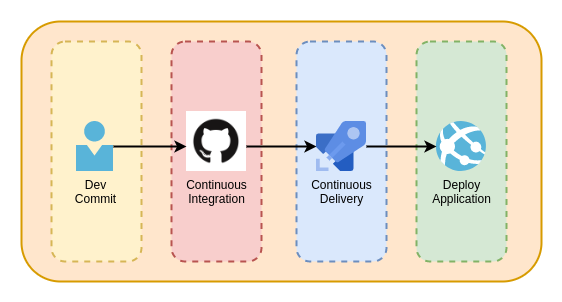
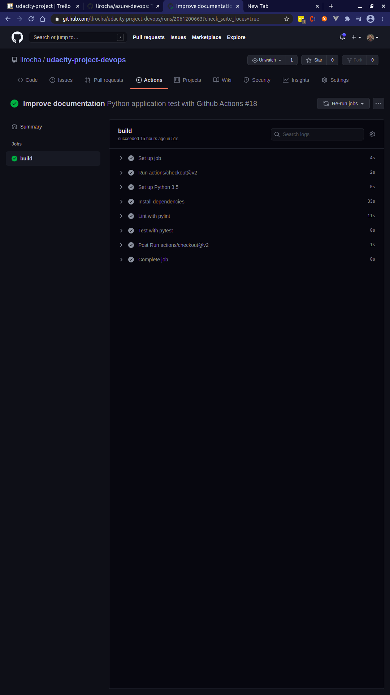
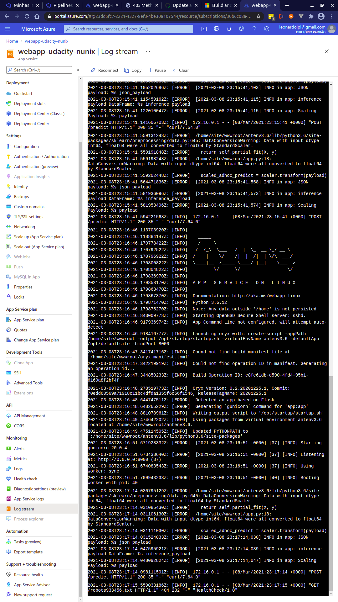

# Overview

Deploy a Flask ML app to Azure

## Project Plan

* A link to a Trello board for the project: https://trello.com/b/eT6AUw5q/udacity-project
* A link to a spreadsheet that includes the original and final project plan: https://drive.google.com/file/d/1RrT3TcG6P63pRohj_yAMQy_4lbWu_Hrt/view?usp=sharing

## Instructions

* Architectural Diagram:<br>


<TODO:  Instructions for running the Python project.  How could a user with no context run this project without asking you for any help.  Include screenshots with explicit steps to create that work. Be sure to at least include the following screenshots:

* Project running on Azure App Service
<br>


* Project cloned into Azure Cloud Shell<br>


* Passing tests that are displayed after running the `make all` command from the `Makefile`<br>


* Output of a test run<br>


* Successful deploy of the project in Azure Pipelines.  [Note the official documentation should be referred to and double checked as you setup CI/CD](https://docs.microsoft.com/en-us/azure/devops/pipelines/ecosystems/python-webapp?view=azure-devops).<br>


* Running Azure App Service from Azure Pipelines automatic deployment<br>


* Successful prediction from deployed flask app in Azure Cloud Shell.  [Use this file as a template for the deployed prediction](https://github.com/udacity/nd082-Azure-Cloud-DevOps-Starter-Code/blob/master/C2-AgileDevelopmentwithAzure/project/starter_files/flask-sklearn/make_predict_azure_app.sh).
The output should look similar to this:

```bash
udacity@Azure:~$ ./make_predict_azure_app.sh
Port: 443
{"prediction":[20.35373177134412]}
```


* Output of streamed log files from deployed application




> 

## Enhancements

- Improve error handling
- Improve tests
- Implement new features

## Demo 

<TODO: Add link Screencast on YouTube>

????


